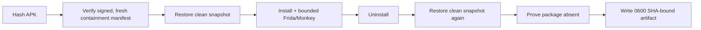

# M3 asynchronous adversarial interrogation runbook

This runbook implements Section 4.3 of `Cybershield (3)-compressed.pdf` while narrowing
the paper's broad “synthesise a bespoke script” language to an executable allowlist. An
LLM may select approved hook and stimulus IDs; it cannot submit shell commands or Frida
source for immediate execution.

## Current acceptance status

| Gate | Repository status | Operational status |
| --- | --- | --- |
| Strict SHA-bound/redacted artifact | Implemented and unit tested | Not yet exercised on a GCE runtime |
| Containment/snapshot fail-closed harness | Implemented and unit tested | Not yet exercised on a GCE runtime |
| Bounded allowlisted closed loop | Implemented and unit tested | Runtime catalogue integration requires inert acceptance |
| Temporary immutable-image builder | Packer/scripts implemented | Not launched in this stage |
| Sealed `n2-standard-4` runtime | Terraform/firewall/startup implemented | Not launched in this stage |
| Inert M3 fixture | Source implemented | APK not built on this host |
| Known-benign APK validation | Procedure defined | Pending review |
| One vetted real sample | Procedure defined | **Blocked until every preceding gate passes** |

M3 is therefore **implemented but not operationally accepted**. Do not call it complete
until the signed containment and inert-fixture evidence from an actual sealed runtime is
reviewed.

## M3-A — local harness

`backend/scripts/dynamic_analyze.py` performs this mandatory sequence:



Every exit passes through `finally`. Snapshot restore is attempted both before and after
the run; either failure makes the artifact non-ingestible. Frida, its session/script,
Monkey, and the spawned package are explicitly stopped. Empty output is `inconclusive`,
never successful/benign. Crashes, timeouts, hook errors, install failures, and cleanup
failures are structured states. OTPs, message bodies, credentials, tokens, device values,
and clipboard contents are redacted before serialization.

## M3-B — immutable tools image

Prerequisites: Packer, `gcloud`, an isolated build network, and the locally built inert
fixture. No malware is permitted on the builder.

```bash
cd infra/m3
export GCP_PROJECT=...
export GCP_NETWORK=...
export GCP_ZONE=...
export DRISHTI_FIXTURE_APK="$PWD/../../demo-apks/m3-inert-fixture/app/build/outputs/apk/debug/app-debug.apk"
export DRISHTI_BANK_ONE_APK=/safe/build/bank-one.apk
export DRISHTI_BANK_TWO_APK=/safe/build/bank-two.apk
export DRISHTI_APPLY=YES
./build_tools_image.sh
```

The script creates temporary DNS/HTTPS and IAP rules, Packer creates/deletes the builder,
and a trap removes all three rules even on failure. The image contains KVM, Android SDK,
the emulator, Frida, mitmproxy, a no-upstream fake C2, the clean snapshot, and the harness.
It contains only the explicitly inert banking environment fixtures; it contains no M3
validation fixture, malware, AndroZoo key, Google credential, or sample.

Finish Phase A only after reviewing its exact resource names:

```bash
GCP_PROJECT=... GCP_REGION=... GCP_ZONE=... \
FEATURE_BUCKET=gs://... FEATURES_CSV=/sealed/extractor/features.csv \
EXTRACTOR_INSTANCE=... CLOUD_ROUTER=... CLOUD_NAT=... DRISHTI_APPLY=YES \
./phase_a_teardown.sh
```

The script uploads only `features.csv`, deletes the extractor and Cloud NAT, and verifies
that both deletions took effect.

## M3-C — sealed runtime

Apply `infra/m3/terraform/runtime` only after NAT deletion. The definition has no
`access_config`, no service-account block, an auto-deleted boot disk, nested KVM,
`n2-standard-4`, the `detonator` tag, IAP-only SSH ingress, and deny-all VPC egress.
Host `OUTPUT`/`FORWARD` default-drop rules block metadata and VPC ranges while preserving
established IAP connections. The emulator can reach only host-local proxy/fake-C2 paths.

Through a fresh IAP SSH session:

```bash
sudo /opt/drishti/emulator_control.sh health
sudo PYTHONPATH=/opt/drishti/harness /opt/drishti/venv/bin/python \
  /opt/drishti/harness/verify_containment.py \
  --private-key /etc/drishti/containment-signing.key \
  --public-key-out /etc/drishti/containment-signing.pub \
  --manifest-out /var/lib/drishti/containment-manifest.json \
  --instance-id "$INSTANCE_ID" --runtime-image "$RUNTIME_IMAGE" \
  --control-plane-attestation /var/lib/drishti/control-plane-attestation.json \
  --control-plane-public-key /etc/drishti/control-plane-review.pub \
  --vpc-probe "$UNREACHABLE_VPC_PROBE"
```

First run `backend/scripts/attest_runtime_control_plane.py` from the authenticated control
machine and transfer only its signed attestation plus reviewer public key through IAP. It
fails unless the API reports no external IP, no Cloud NAT on the network, no service
account, the exact machine type, nested virtualization, the detonator tag, and auto-delete
disks. All eight runtime probes must then be true: host internet blocked, emulator internet/metadata/VPC
blocked, external IP absent, IAP session active, nested KVM functional, and both host
firewall chains default-drop. The Ed25519 manifest expires within ten minutes by default.
The harness has no override for a missing, invalid, wrong-signer, or stale manifest.

## M3-D — inert acceptance

Build only the source in `demo-apks/m3-inert-fixture`. On the sealed runtime run one
analysis with `--emulator-image` set to the immutable image identifier. Expected hooks are
clipboard read/write, `Cipher.doFinal`, `URL.openConnection`, and `DexClassLoader`.

```bash
PYTHONPATH=/opt/drishti/harness /opt/drishti/venv/bin/python \
  /opt/drishti/harness/dynamic_analyze.py /opt/drishti/samples/m3-inert-fixture.apk \
  --out /opt/drishti/results/fixture.json --emulator-image "$RUNTIME_IMAGE"
```

Copy out only `fixture.json`. On the backend, validate and publish it under the exact hash:

```bash
cd backend
python scripts/accept_m3_fixture.py --apk /safe/path/m3-inert-fixture.apk \
  --artifact /safe/path/fixture.json --observations-dir ../observations
```

Submit the fixture once without the file (report must say `dynamic: absent`), then again
after publication (report must say `dynamic: observed`). The latter must cite ledger nodes
whose type is `dynamic_obs`, source is `sandbox_real`, and content begins `[OBSERVED]`.
Archive the report comparison, containment manifest, and package-absence proof for review.

## M3-E — one-sample pilot

Do not proceed until the inert fixture and one known-benign APK pass. Select one legally
obtained, vetted sample by hash. Acquire it on a temporary controlled staging VM—not a
laptop—and transfer it through IAP directly to the runtime. The runtime never receives an
AndroZoo key or bucket role. Create a short-lived `PilotAuthorization` JSON naming the exact
SHA-256, immutable runtime image, reviewer, expiry, and maximum duration. The harness
requires `--sample-kind vetted_malware --pilot-authorization ...` and rejects a mismatch or
stale approval. Re-run containment after transfer, detonate once for a bounded duration,
export only the sanitized JSON, and delete the runtime/disk and staging VM.

Review exactly three cases before scaling: the inert malicious-looking fixture, one known
benign APK, and one vetted sample. “No observation” is inconclusive. Never batch samples,
install a real sample on a phone, attach Cloud NAT, or route the sample through the API.

## M3-F — bounded closed loop

`drishti.sandbox.interrogation` implements M2 hypothesis → catalogue selection → bounded
attempt → crash/no-observation analysis → at most three repaired attempts → ledger append
→ child hypothesis. Recursion depth is at most three and total runtime at most 30 minutes.
The catalogue covers synthetic SMS/contact history, approved locale/SIM/device/time
profiles, inert banking fixtures, no-upstream fake-C2 templates, and redacted decrypted
payload observation. Every plan, stimulus, retry, stop, and observed event is ledgered.

Physical bare-metal auto-escalation described in the paper is deliberately not automated:
it would expand the safety boundary and cannot be accepted by emulator containment tests.
Any future device-farm tier requires a separately reviewed reflash, custody, and network
control design.

## Destruction and review checklist

- Confirm the sample SHA equals every artifact SHA and the backend lookup filename.
- Confirm snapshot before/after passed and package absence is true.
- Confirm no raw secrets appear in the artifact.
- Confirm the signed manifest was current at admission and all checks were true.
- Confirm observed evidence changes the dynamic score; absent/simulated evidence does not.
- Confirm the backend never invoked the harness.
- Destroy the sample runtime and auto-delete disk; verify both are absent.
- Retain only sanitized observations, signed containment manifest, hashes, and ledger/report.
