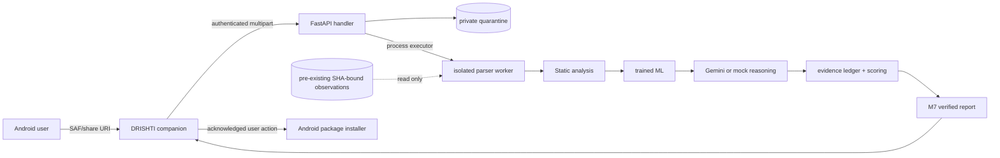
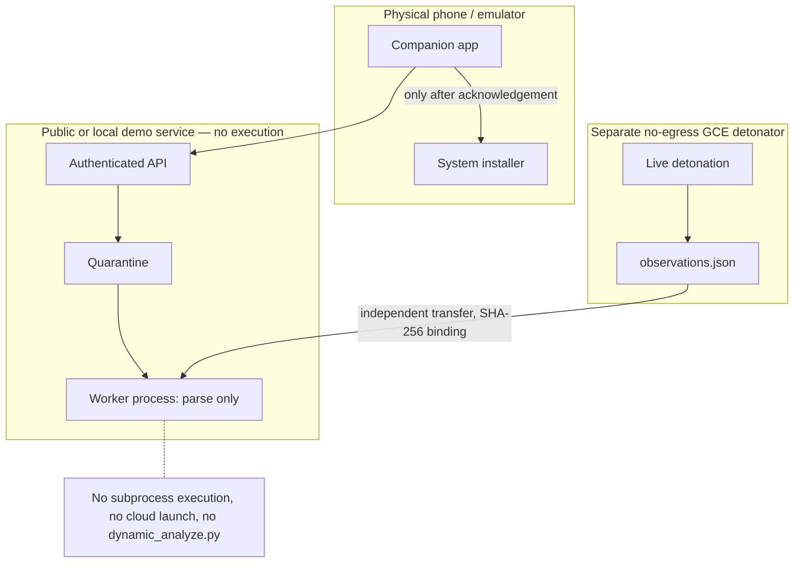

# DRISHTI Android pre-install analysis demo

DRISHTI lets a user explicitly select or share an APK, uploads it to an authenticated analysis service, and presents a citation-backed verdict before the user chooses whether to open Android's normal installer. The instant verdict uses static analysis, a trained/calibrated ML model, and Gemini reasoning (or a clearly marked deterministic mock). No APK is executed by the API.

## What has been built

This repository now contains the complete end-to-end demonstration rather than only the original analysis stages:

| Area | Delivered implementation |
| --- | --- |
| M1–M3 analysis | APK ingestion, validation, static features, suspicious capabilities, IOCs, and MITRE Mobile mappings |
| M4 reasoning | Gemini structured reasoning with a deterministic, visibly labelled mock fallback and sanitized MLflow tracing |
| M5 prediction | Trained-model loading through `TRAINED_MODEL_PATH`, calibrated classification, model-version reporting, and an in-memory synthetic demo fallback |
| M6 evidence and score | Evidence ledger, confidence-aware threat scoring, and separate absent/simulated/observed dynamic provenance |
| M7 reporting | Pydantic report contracts that convert verdicts and ledger entries into Android-friendly, citation-checked results with conservative potential consequences |
| Analysis API | Authenticated FastAPI upload and polling endpoints, private quarantine, upload limits, APK/ZIP validation, isolated parser workers, and cleanup after every job |
| Android companion | Kotlin/Compose app with SAF and share-intent intake, local SHA-256, multipart progress, polling, notifications, detailed verdict/evidence screens, and acknowledged installer handoff |
| Safe demonstration | A deliberately inert `shady-demo` Android fixture that declares selected suspicious permissions but performs no harmful behavior |
| Quality evaluation | MLflow 3 native GenAI datasets, tracing, registered scorers/judges, offline-safe evaluation scripts, and analysis tooling |
| Delivery | Docker image, Compose configuration, environment template, one-command startup, security documentation, and a 3–5 minute judging script |

## Why it is designed this way

- **Pre-install assistance, not silent enforcement.** Stock Android does not let an ordinary companion app intercept every installation. DRISHTI therefore analyzes only an APK the user selects or shares, explains the risk, and leaves the final installation decision to Android's system UI.
- **A useful instant result without unsafe detonation.** Static evidence, the trained ML classifier, and Gemini reasoning produce the immediate verdict. The public service never executes an APK, so analysis can run locally or as a public demo without turning that service into a malware sandbox.
- **Dynamic provenance cannot be blurred.** Runtime evidence is `observed` only when an independently produced `observations.json` has the exact APK SHA-256. Simulation remains `simulated`, absence remains `absent`, and simulated behavior cannot be presented or scored as an observed runtime event.
- **Claims must be auditable.** Material GenAI conclusions are retained only when they cite valid evidence-ledger node IDs. Potential consequences are derived from verified capabilities and use “can” or “could” language; unsupported claims are omitted rather than made more dramatic.
- **Untrusted files have a narrow lifetime.** Uploads receive random names, stay outside static serving, are parsed in a separate worker process, and are deleted after success or failure. Size and archive validation happen before analysis, and neither APK bytes nor secrets enter application logs or MLflow traces.
- **The phone remains under user control.** The selected content URI is copied only to app-private cache. Continuing requires an explicit acknowledgement, checks Android's unknown-source setting, and invokes the normal package installer; cancel/delete removes the cached copy.
- **Evaluation is reproducible and safe.** MLflow evaluates sanitized structured evidence rather than APKs. Offline tests use deterministic scorers and mocks, while optional registered judges can be enabled deliberately for a configured model.

## Repository map

```text
backend/drishti/          M1–M7 pipeline, API, reporting, tracing and evaluation
backend/tests/            Existing suite plus API, reporting, provenance and security tests
android-client/           DRISHTI Kotlin/Jetpack Compose companion application
demo-apks/shady-demo/     Inert physical-phone demonstration fixture
docker-compose.yml        Local analysis service
DEMO_SCRIPT.md            3–5 minute judging presentation
```

## Verified project status

- Backend suite: **86 passed**, including all 76 tests that existed before the end-to-end work.
- Backend container: built successfully; `/health` and a complete multipart analysis/report flow were exercised with dynamics absent.
- MLflow: dataset discovery/reuse, eight registered evaluation checks, tracing validation, evaluation, and result analysis were exercised without uploading APK content.
- Android: Gradle wrapper and unit tests are included. A debug build still requires JDK 17 and Android SDK 35 on the build machine; these tools were not available in the verification environment.
- No APK, malware sample, observation artifact, features CSV, secret, or trained model binary is tracked by the intended project commit.

## Start the backend

```bash
cp .env.example .env
# edit DEMO_API_TOKEN; optionally configure Gemini and a trained model
docker compose up --build
curl http://localhost:8000/health
```

Equivalent local Python path:

```bash
python3.12 -m venv .venv
source .venv/bin/activate
pip install -e "./backend[dev]"
uvicorn drishti.api.app:app --app-dir backend --host 0.0.0.0 --port 8000 --no-access-log
```

`make demo` is the one-command path after `.env` exists. Uploaded files receive random server names, live only in the non-served quarantine, are parsed in a worker process, and are deleted after success or failure.

## Android emulator

1. Install Android Studio, JDK 17, Android SDK 35, and create an API 35 emulator.
2. Open `android-client/`, let Gradle sync, then run the `app` configuration.
3. Configure the app with `http://10.0.2.2:8000/` and the `DEMO_API_TOKEN` from `.env`.
4. Build the inert fixture from `demo-apks/shady-demo/` and copy its debug APK into emulator Downloads. Build outputs are ignored and must never be committed.
5. In DRISHTI choose **Select APK**, or share the downloaded fixture to DRISHTI.

Command-line build when an Android SDK/JDK are installed:

```bash
cd android-client
./gradlew testDebugUnitTest assembleDebug
./gradlew -p ../demo-apks/shady-demo assembleDebug
adb install -r app/build/outputs/apk/debug/app-debug.apk
```

The checked-in Gradle 8.9 wrapper supplies the build tool; Android SDK 35 and JDK 17 are still required.

## Physical device

Connect the phone and computer to the same trusted network, bind the backend only as broadly as needed, and configure the app with the computer's LAN address, for example `http://192.168.1.20:8000/`. For a cable-only path, use `adb reverse tcp:8000 tcp:8000` and `http://127.0.0.1:8000/`.

Only the repository's inert `shady-demo` fixture is appropriate for a physical demo phone. **Never download, transfer, analyze by executing, or install real malware on a physical phone.** Delete/cancel is the normal judging path. If continuing with the inert fixture, Android may require per-app “install unknown apps” permission and always displays its own installer confirmation.

## Model and Gemini selection

- `TRAINED_MODEL_PATH` selects a joblib classifier produced by the existing M5 training workflow. For Compose, place it under `MODEL_HOST_DIR` and set a container path such as `/models/androzoo.joblib`. Model files are ignored and excluded from Docker build context. If unset, local demo mode trains the documented synthetic baseline in memory and reports `baseline-synthetic-v1`.
- Set both `GEMINI_API_KEY` and `GEMINI_MODEL` for live reasoning. With either absent, the deterministic mock is used and both health/report responses identify mock mode.
- API logs and MLflow traces exclude APK bytes, API keys, extracted IOC values, certificate subjects, and dynamic details.

## Dynamic evidence

The public API cannot detonate an APK and never invokes `dynamic_analyze.py`. It checks only for a pre-existing read-only artifact named `observations/<sha256>.json`. The JSON must contain the exact lowercase `sha256` of the uploaded APK; mismatch fails closed. These artifacts are generated only by the separately configured no-egress GCE detonator and are ignored by Git.

Absent evidence stays `absent`. Requested simulation stays `simulated` and cannot raise the observed-runtime score factor. A SHA-matched real artifact stays `observed`. Simulation is never substituted for an unavailable observation.

The hardened asynchronous M3 harness, immutable-image/runtime definitions, inert dynamic
fixture, signed containment admission, and bounded allowlisted interrogation controller are
documented in [M3_RUNBOOK.md](M3_RUNBOOK.md). They are implemented and locally tested but
are not labelled operationally accepted until the GCE containment and inert-fixture gates
have actually been run and reviewed. No cloud resource or malware was launched while
implementing this stage.

## Stock Android limitation

DRISHTI is a companion and decision-support app, not a device-owner security controller. On stock Android it cannot silently intercept or block every installation. It sees only APKs the user selects or shares, and “Continue” hands the cached APK to Android's user-controlled package installer after an explicit acknowledgement.

## MLflow GenAI evaluation

Evaluation data contains sanitized structured evidence, never APKs. Example flow:

```bash
cd backend
python scripts/mlflow_validate_tracing.py
python scripts/mlflow_create_dataset.py --name drishti_eval_v1
python scripts/mlflow_register_scorers.py
python scripts/mlflow_run_evaluation.py --dataset drishti_eval_v1
python scripts/mlflow_analyze_results.py <run-id>
```

The evaluation uses `mlflow.genai.datasets.create_dataset()` after discovery, serializable registered `make_judge()` scorers, deterministic offline code scorers, and `mlflow.genai.evaluate()`. The eight checks cover schema, citations, grounding, MITRE mapping, high-impact unsupported claims, conservative language, prompt injection, and benign false alarms. Supplying `--judge-model provider:/model` configures the registered judges; registration itself does not call the model.

## Architecture



## Threat boundary



Security assumptions: TLS terminates in front of the service outside localhost; the demo token is rotated and kept out of source; quarantine and observation mounts are access-controlled; the trained model and observation producer are trusted; the GCE detonator is separately administered with no egress; and a production deployment replaces the in-memory store and single demo token with durable storage and real identity controls.
