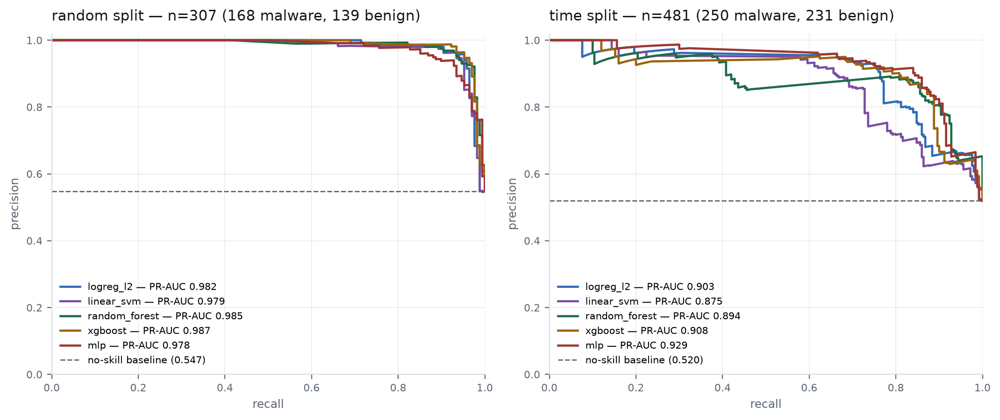
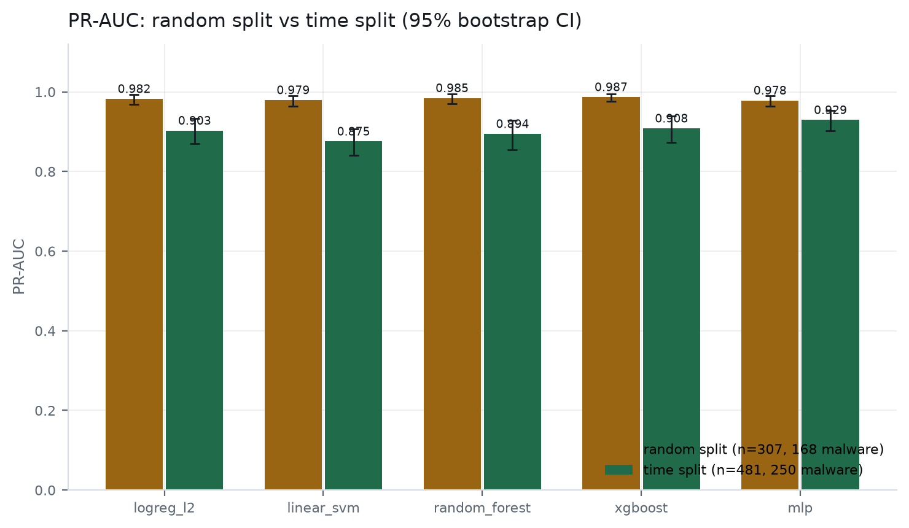
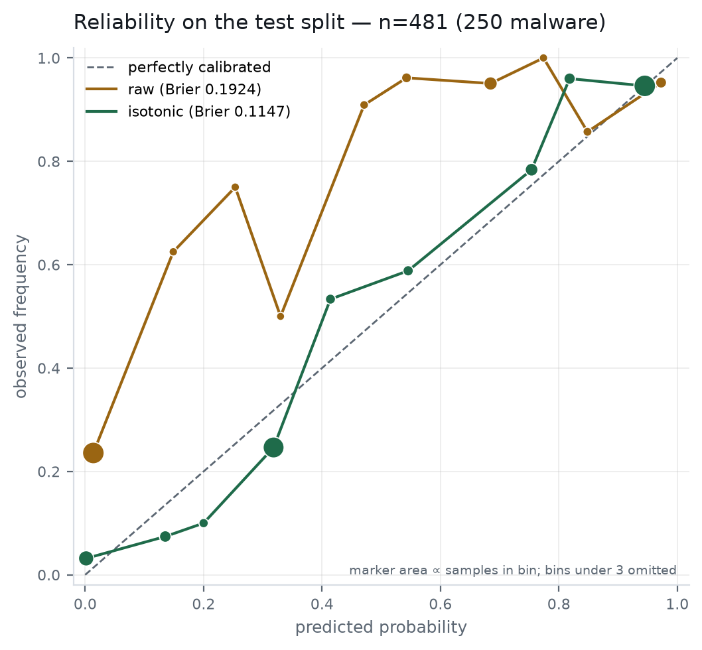
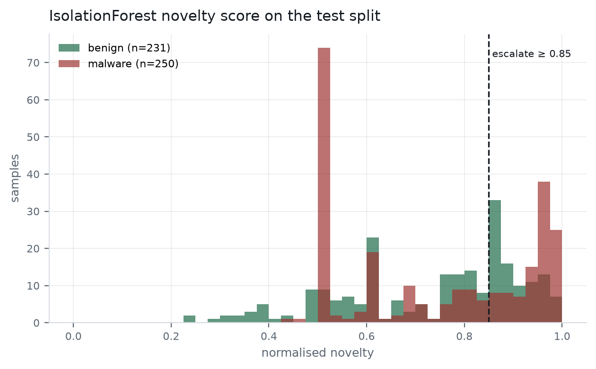
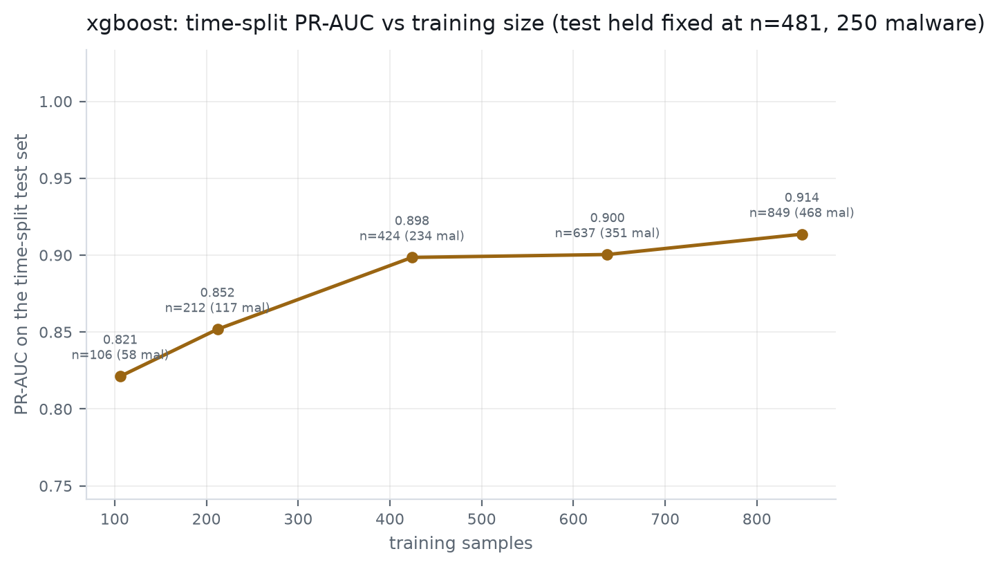
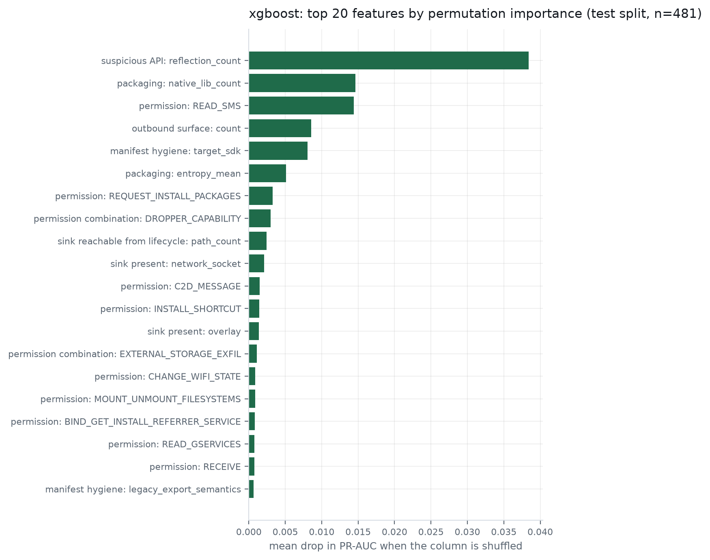
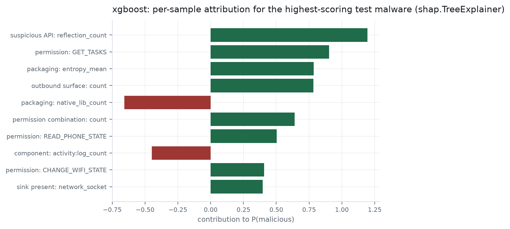

# DRISHTI — ML results

**Generated by `scripts/train_and_report.py`. Every number below was measured in the run recorded at `2026-08-26T07:01:28.472697+00:00`; nothing here is an estimate, a target, or carried over from a previous build.**

> calib/test boundary was re-cut inside the held-out bands (sha256 bucket < 3 of 10 -> calib, else test; applied to the held-out bands only, label-independent, train untouched) because the shipped calibration split held 5 malware rows, under the 10 needed to fit a calibrator. Train untouched, so this is still a time split.

## 1. What was actually trained on

Feature schema `1.2.0`, extracted by real M2 over real APKs on the GCE extractor VM. Training and inference call the same `m5_ml.features.extract`; `tests/contract/test_feature_parity.py` is what keeps that true.

- Sources: `data/corpus/features.jsonl`
- Usable extracted samples: **1537**
- Dropped: 27 failed extraction, 0 produced no features (dropped, never zero-filled — a sample androguard could not parse is missing data, and a row of zeros would teach the model that unparseable looks harmless)
- Vocabulary: **426** features, frozen from training rows only

| split | n | malware | benign |
|---|---:|---:|---:|
| train | 849 | 468 | 381 |
| calib | 207 | 122 | 85 |
| test | 481 | 250 | 231 |

Time-split integrity: train bands ['2018-2020', '2021-2023', '<=2017'] are disjoint from ['2024-2026']

**This corpus was written by two extractor versions, and four features were dropped because of it.** Extraction ran for days and the extractor was fixed mid-batch, so the rows divide by schema epoch: **1.1.0** 859 rows (67% malware), **1.2.0** 678 rows (38% malware). A feature only one version emits is absent from the other version's rows, and projection would zero-fill it — which encodes *when the row was extracted*, not anything about the sample. That is not neutral here: the epochs have very different malware rates, so the zero-fill would have been a proxy for the label and every ranking metric would have rewarded it. Dropped from both vocabularies: `cert:age_days`, `cert:is_fresh`, `cert:validity_days`, `cert:validity_over_20y`. `dataset.epoch_divergent_features` finds these by measuring per-epoch presence rates; nothing is dropped by hand.

**The calib/test boundary was re-cut.** The shipped calibration split held 5 malware rows, under the 10 needed to fit a calibrator, so the held-out rows were re-partitioned: sha256 bucket < 3 of 10 -> calib, else test; applied to the held-out bands only, label-independent, train untouched. 180 rows moved test -> calib and 69 moved calib -> test. The training split was not touched, so test remains strictly newer than train and this is still a time split. Assignment is by hash bucket and therefore label-independent — assigning by label would have manufactured whatever balance flattered the numbers.

| split | before (n / malware) | after (n / malware) |
|---|---|---|
| calib | 96 / 5 | 207 / 122 |
| test | 592 / 367 | 481 / 250 |

`vt_detection` is **not** a feature. AndroZoo's label is thresholded `vt_detection`, so a VirusTotal-derived input would make every metric below circular; `dataset.assert_no_label_leak` refuses such a vocabulary outright.

## 2. Model comparison

| model | specification |
|---|---|
| `logreg_l2` | Logistic regression, L2, C=1.0, balanced class weight, standardised inputs |
| `linear_svm` | LinearSVC (squared hinge, C=0.5, balanced) + 5-fold Platt inside train |
| `random_forest` | RandomForest, 400 trees, balanced_subsample, min_samples_leaf=2 |
| `xgboost` | XGBoost hist, 400 rounds, depth 6, lr 0.06, scale_pos_weight=neg/pos |
| `mlp` | MLP (128, 64), ReLU, adam, early stopping on a 10% internal validation slice |

All five see identical features, identical splits and seed `20260826`. The only variable is the model.

### 2.1 Full results — every model, every split

| model | split | n | n_pos | n_neg | PR-AUC | PR-AUC 95% CI | ROC-AUC | ROC-AUC 95% CI | P | R | F1 | TP | FP | TN | FN | FPR@90%R |
|---|---|---:|---:|---:|---:|---|---:|---|---:|---:|---:|---:|---:|---:|---:|---:|
| `logreg_l2` | time | 481 | 250 | 231 | 0.9027 | [0.8693, 0.9325] | 0.8864 | [0.8568, 0.9145] | 0.6620 | 0.9560 | 0.7823 | 239 | 122 | 109 | 11 | 0.5065 |
| `logreg_l2` | random | 307 | 168 | 139 | 0.9824 | [0.9688, 0.9925] | 0.9717 | [0.9505, 0.9895] | 0.9632 | 0.9345 | 0.9486 | 157 | 6 | 133 | 11 | 0.0216 |
| `linear_svm` | time | 481 | 250 | 231 | 0.8755 | [0.8410, 0.9076] | 0.8486 | [0.8140, 0.8810] | 0.7226 | 0.7920 | 0.7557 | 198 | 76 | 155 | 52 | 0.5714 |
| `linear_svm` | random | 307 | 168 | 139 | 0.9793 | [0.9643, 0.9905] | 0.9688 | [0.9462, 0.9873] | 0.9686 | 0.9167 | 0.9419 | 154 | 5 | 134 | 14 | 0.0288 |
| `random_forest` | time | 481 | 250 | 231 | 0.8945 | [0.8548, 0.9292] | 0.8946 | [0.8630, 0.9224] | 0.8803 | 0.8240 | 0.8512 | 206 | 28 | 203 | 44 | 0.2338 |
| `random_forest` | random | 307 | 168 | 139 | 0.9845 | [0.9697, 0.9948] | 0.9803 | [0.9636, 0.9934] | 0.9353 | 0.9464 | 0.9408 | 159 | 11 | 128 | 9 | 0.0288 |
| `xgboost` | time | 481 | 250 | 231 | 0.9082 | [0.8723, 0.9396] | 0.8994 | [0.8688, 0.9281] | 0.8904 | 0.8120 | 0.8494 | 203 | 25 | 206 | 47 | 0.4502 |
| `xgboost` | random | 307 | 168 | 139 | 0.9869 | [0.9758, 0.9955] | 0.9807 | [0.9649, 0.9939] | 0.9639 | 0.9524 | 0.9581 | 160 | 6 | 133 | 8 | 0.0144 |
| `mlp` | time | 481 | 250 | 231 | 0.9293 | [0.9028, 0.9535] | 0.9180 | [0.8922, 0.9425] | 0.8571 | 0.8640 | 0.8606 | 216 | 36 | 195 | 34 | 0.2078 |
| `mlp` | random | 307 | 168 | 139 | 0.9784 | [0.9633, 0.9895] | 0.9717 | [0.9540, 0.9862] | 0.8785 | 0.9464 | 0.9112 | 159 | 22 | 117 | 9 | 0.0719 |

`FPR@90%R` is the false-positive rate at the lowest threshold that still reaches 90% recall — the triage-desk question: *if we insist on catching nine in ten, how much clean traffic does an analyst wade through?* `n/a` means no threshold reached that recall.

Confidence intervals are 2000-resample percentile bootstraps. Read the interval, not the point estimate — especially on the time split, where the malware count is **250**.

## 3. The random-vs-time-split gap

| model | random-split PR-AUC | time-split PR-AUC | gap | CV PR-AUC in train |
|---|---:|---:|---:|---|
| `logreg_l2` | 0.9824 | 0.9027 | +0.0797 | 0.9663 ± 0.0231 |
| `linear_svm` | 0.9793 | 0.8755 | +0.1038 | 0.9548 ± 0.0374 |
| `random_forest` | 0.9845 | 0.8945 | +0.0900 | 0.9828 ± 0.0076 |
| `xgboost` | 0.9869 | 0.9082 | +0.0787 | 0.983 ± 0.0059 |
| `mlp` | 0.9784 | 0.9293 | +0.0491 | 0.9804 ± 0.0073 |

Random split: n=307 (168 malware, prevalence 0.547). Time split: n=481 (250 malware, prevalence 0.520). The two prevalences differ, so compare each PR-AUC against its own no-skill baseline (drawn on `ml_pr_curves.png`) rather than against each other directly.

The gap is the finding, not an embarrassment. A random split lets a model see 2024 malware families while being tested on their siblings; a time split does not. Whatever the gap is here, it is the measured cost of concept drift on this corpus — and the argument for the behavioural and GenAI layers that do not depend on having seen the family before.

## 4. Winner

**`xgboost`** — highest 5-fold CV PR-AUC inside the training split (0.983 ± 0.0059); the test split played no part.

Selection is by cross-validation **inside the training split**. Picking the best of five models by test PR-AUC would turn the test set into a validation set, and every number reported from it afterwards would be the best of five draws rather than an estimate of field performance.

- Shipped `model_version`: `xgboost-426f-1.2.0`
- Operating threshold: `0.048488` — max-F1 on the calibration split (n=207). Chosen on the calibration split; the test split never informed it.
- Per-sample attribution method: `shap.TreeExplainer`

## 5. Calibration

Fitted on the held-out **calib** split (n=207, 122 malware), never on test.

- Method chosen: **isotonic**
- Rejected `sigmoid`: higher cross-validated Brier on calib (0.144518)
- Brier on test: **0.19238 -> 0.114746** (n=481, 250 malware)
- Expected calibration error on test: **0.229565 -> 0.046637**

| method | Brier on test | ECE on test |
|---|---:|---:|
| isotonic | 0.114746 | 0.046637 |
| sigmoid | 0.133792 | 0.118899 |
- Bucket check (before): of the 14 test samples scored 0.75-0.85, **92.9%** were malware against an expected 80% — **outside** the ±10% tolerance. Informative.
- Bucket check (after): of the 55 test samples scored 0.75-0.85, **83.6%** were malware against an expected 80% — within the ±10% tolerance. Informative.

That bucket check is `PHASE_2` T2.4's acceptance criterion and the one a reader can verify by hand. A model can pass every ranking metric and still fail it, and when it does an entire band of verdicts lands in the wrong bucket.

The method is chosen by cross-validated Brier **within** the calibration split. Choosing it by its test Brier would be the same leak as calibrating on test, one level of indirection away.

## 6. Novelty escalator (T2.5)

`IsolationForest`, 200 trees, fitted on **381 benign training rows only** — fitting on a mixed corpus would teach it that malware is normal. The published score is a percentile against that benign distribution, so the threshold means the same thing across retrainings.

- Escalates at `0.85`; on the test split (n=481) it escalated **101** malware and **90** benign samples
- Benign escalation rate **0.3896**, malware escalation rate **0.4040**. The benign rate is the analyst cost this flag creates and belongs next to the claim it supports.

**This escalator does not discriminate on this corpus.** It fires on 0.4040 of malware and 0.3896 of benign samples — a lift of +0.0144, which is close enough to zero that escalation carries almost no information about the label. It is reported here rather than tuned until it looks good: a novelty flag fitted on 381 benign rows is measuring how unusual a sample is against a *small and narrow* notion of normal, and on this corpus that is not the same question as whether it is malicious. Treat the flag as an unproven analyst prompt, not as evidence, until the benign training population is large and diverse enough for it to mean something.

It is an **escalator, not an additive term**: it forces the band to at least HIGH and requires human review, and it never moves `S`.

## 6b. How much did the training data buy?

The corpus was extracted **test split first**, so the binding constraint on this build is training data, not evaluation data. That makes the useful question not what the PR-AUC is but whether it is still climbing. The winner was refitted on stratified nested subsamples of the training split, with the test split held fixed:

| training n | of which malware | time-split PR-AUC |
|---:|---:|---:|
| 106 | 58 | 0.8212 |
| 212 | 117 | 0.8518 |
| 424 | 234 | 0.8985 |
| 637 | 351 | 0.9004 |
| 849 | 468 | 0.9136 |

Going from 106 to 849 training samples moved time-split PR-AUC by **+0.0924** — 743 additional samples. Whether that curve has flattened is the measured answer to "would more extraction have helped", and it is a claim about this corpus rather than a guess.

## 7. What the model leans on (T2.6)

Global importance measured by permutation on the test split (n=481): each column is shuffled and the drop in PR-AUC recorded. Model-agnostic and measured, rather than read off internal weights.

Method as run: `permutation importance on PR-AUC (5 repeats, shortlisted to the 60 highest-ranked of 426 columns before measuring)`.

| feature | mean drop in PR-AUC when shuffled |
|---|---:|
| `api:reflection_count` | 0.038423 |
| `archive:native_lib_count` | 0.014606 |
| `perm:READ_SMS` | 0.01443 |
| `url:count` | 0.008553 |
| `manifest:target_sdk` | 0.008079 |
| `archive:entropy_mean` | 0.005076 |
| `perm:REQUEST_INSTALL_PACKAGES` | 0.003252 |
| `combo:DROPPER_CAPABILITY` | 0.002995 |
| `reach:path_count` | 0.002403 |
| `sink:network_socket` | 0.002121 |
| `perm:C2D_MESSAGE` | 0.001497 |
| `perm:INSTALL_SHORTCUT` | 0.001427 |
| `sink:overlay` | 0.001392 |
| `combo:EXTERNAL_STORAGE_EXFIL` | 0.001111 |
| `perm:CHANGE_WIFI_STATE` | 0.000886 |

Per-sample attribution (`shap.TreeExplainer`) for the highest-scoring malware in the test split — the shape the report and the UI panel render:

| feature | value | contribution |
|---|---:|---:|
| `api:reflection_count` | 3.0 | 1.195091 |
| `perm:GET_TASKS` | 1.0 | 0.902288 |
| `archive:entropy_mean` | 6.778864629385369 | 0.784557 |
| `url:count` | 0.0 | 0.781958 |
| `archive:native_lib_count` | 20.0 | -0.657706 |
| `combo:count` | 4.0 | 0.639143 |
| `perm:READ_PHONE_STATE` | 1.0 | 0.504109 |
| `component:activity:log_count` | 4.48863636973214 | -0.44832 |
| `perm:CHANGE_WIFI_STATE` | 1.0 | 0.40691 |
| `sink:network_socket` | 0.0 | 0.397507 |

## 8. Limitations

- The time-split test set holds **250 malware rows**. Every time-split number rests on that count; the bootstrap intervals in §2.1 are the honest width of the claim.
- Recent-band malware labels come from MalwareBazaar while older-band labels come from AndroZoo's thresholded `vt_detection` — the two halves of the corpus are not labelled by the same process.
- Static features only. Nothing here has seen a runtime trace; the behavioural and GenAI layers are what cover the gap this table measures.
- The novelty escalator (§6) separates the classes by +0.0144 on this corpus and is therefore not currently carrying weight. It is shipped because it is an escalator that never moves `S`, but no claim of novelty detection should be made from this run.
- The corpus was extracted by two schema versions, so the four certificate features that differ between them (§1) are absent from every model here. The certificate-validity signal is therefore **untested**, not disproven — it needs a corpus re-extracted end to end by a single extractor version.
- Binary maliciousness only. The corpus carries no family labels that are not derived from `vt_detection`, and weak-labelling from the same signal that produced the binary label would be circular — so the multi-label panel is GenAI-derived, as PHASE_2 T2.3 allows, and must be labelled that way in the UI.

## 9. Figures this run supersedes

`docs/figures/precision_recall.png`, `reliability.png`, `feature_importance.png`, `corpus_composition.png` and `docs/figures/metrics.json` come from an earlier 397-sample pilot and are **not** regenerated here — this run writes `ml_`-prefixed files instead, so nothing is silently overwritten. `REPORT/main.tex` still `\includegraphics` the old names and its prose still quotes the pilot's PR-AUC. **Whoever owns the paper must repoint those figures at the `ml_` files and requote from this document**, or the paper will cite a model that is no longer the one in `models/`.

Raw metrics: `docs/figures/ml_metrics.json` and `models/metrics.json`. Model card: `models/model_card.json`.
