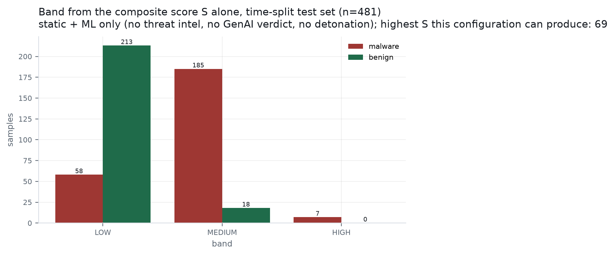

# DRISHTI — ML results

**Generated by `scripts/train_and_report.py`. Every number below was measured in the run recorded at `2026-08-26T09:56:19.090419+00:00`; nothing here is an estimate, a target, or carried over from a previous build.**

> single-epoch corpus: all 859 stale 1.1.0 rows re-extracted from the retained APKs; the four certificate columns are re-admitted and measured in section 6c rather than assumed useful
> calib/test boundary was re-cut inside the held-out bands (sha256 bucket < 3 of 10 -> calib, else test; applied to the held-out bands only, label-independent, train untouched) because the shipped calibration split held 5 malware rows, under the 10 needed to fit a calibrator. Train untouched, so this is still a time split.

## 1. What was actually trained on

Feature schema `1.2.0`, extracted by real M2 over real APKs on the GCE extractor VM. Training and inference call the same `m5_ml.features.extract`; `tests/contract/test_feature_parity.py` is what keeps that true.

- Sources: `data/corpus/features.jsonl`
- Usable extracted samples: **1537**
- Dropped: 27 failed extraction, 0 produced no features (dropped, never zero-filled — a sample androguard could not parse is missing data, and a row of zeros would teach the model that unparseable looks harmless)
- Vocabulary: **428** features, frozen from training rows only

| split | n | malware | benign |
|---|---:|---:|---:|
| train | 849 | 468 | 381 |
| calib | 207 | 122 | 85 |
| test | 481 | 250 | 231 |

Time-split integrity: train bands ['2018-2020', '2021-2023', '<=2017'] are disjoint from ['2024-2026']

**Single-epoch corpus, verified rather than assumed: `1.2.0` 1537 rows (54.6% malware), and `dataset.epoch_divergent_features` finds no divergent column.** A previous build of this corpus was written by two extractor versions with very different class balance, which made a feature's mere *presence* a proxy for the label — projection zero-fills a column the other version never emitted, so the model learns *when the row was extracted*. Four certificate columns were dropped for that reason and could not be evaluated at all. The stale rows have since been re-extracted from the retained APKs, the guard is re-run on every training run, and nothing is excluded here. What that buys is the ability to *test* those columns; §6c is the test, and it is a measurement rather than a promotion.

**The calib/test boundary was re-cut.** The shipped calibration split held 5 malware rows, under the 10 needed to fit a calibrator, so the held-out rows were re-partitioned: sha256 bucket < 3 of 10 -> calib, else test; applied to the held-out bands only, label-independent, train untouched. 180 rows moved test -> calib and 69 moved calib -> test. The training split was not touched, so test remains strictly newer than train and this is still a time split. Assignment is by hash bucket and therefore label-independent — assigning by label would have manufactured whatever balance flattered the numbers.

| split | before (n / malware) | after (n / malware) |
|---|---|---|
| calib | 96 / 5 | 207 / 122 |
| test | 592 / 367 | 481 / 250 |

`vt_detection` is **not** a feature. AndroZoo's label is thresholded `vt_detection`, so a VirusTotal-derived input would make every metric below circular; `dataset.assert_no_label_leak` refuses such a vocabulary outright.

## 2. Model comparison

| model | specification |
|---|---|
| `logreg_l2` | Logistic regression, L2, C=1.0, balanced class weight, standardised inputs |
| `linear_svm` | LinearSVC (squared hinge, C=0.5, balanced) + 5-fold Platt inside train |
| `random_forest` | RandomForest, 400 trees, balanced_subsample, min_samples_leaf=2 |
| `xgboost` | XGBoost hist, 400 rounds, depth 6, lr 0.06, scale_pos_weight=neg/pos |
| `mlp` | MLP (128, 64), ReLU, adam, early stopping on a 10% internal validation slice |

All five see identical features, identical splits and seed `20260826`. The only variable is the model.

### 2.1 Full results — every model, every split

| model | split | n | n_pos | n_neg | PR-AUC | PR-AUC 95% CI | ROC-AUC | ROC-AUC 95% CI | P | R | F1 | TP | FP | TN | FN | FPR@90%R |
|---|---|---:|---:|---:|---:|---|---:|---|---:|---:|---:|---:|---:|---:|---:|---:|
| `logreg_l2` | time | 481 | 250 | 231 | 0.9071 | [0.8741, 0.9367] | 0.8925 | [0.8633, 0.9198] | 0.6630 | 0.9680 | 0.7870 | 242 | 123 | 108 | 8 | 0.4719 |
| `logreg_l2` | random | 307 | 168 | 139 | 0.9823 | [0.9687, 0.9923] | 0.9716 | [0.9505, 0.9893] | 0.9576 | 0.9405 | 0.9489 | 158 | 7 | 132 | 10 | 0.0216 |
| `linear_svm` | time | 481 | 250 | 231 | 0.8834 | [0.8483, 0.9146] | 0.8633 | [0.8302, 0.8948] | 0.7010 | 0.8720 | 0.7772 | 218 | 93 | 138 | 32 | 0.4545 |
| `linear_svm` | random | 307 | 168 | 139 | 0.9797 | [0.9638, 0.9911] | 0.9697 | [0.9470, 0.9880] | 0.9684 | 0.9107 | 0.9387 | 153 | 5 | 134 | 15 | 0.0360 |
| `random_forest` | time | 481 | 250 | 231 | 0.8962 | [0.8569, 0.9291] | 0.8863 | [0.8525, 0.9174] | 0.8959 | 0.7920 | 0.8408 | 198 | 23 | 208 | 52 | 0.2468 |
| `random_forest` | random | 307 | 168 | 139 | 0.9858 | [0.9714, 0.9958] | 0.9821 | [0.9669, 0.9941] | 0.9573 | 0.9345 | 0.9458 | 157 | 7 | 132 | 11 | 0.0216 |
| `xgboost` | time | 481 | 250 | 231 | 0.9169 | [0.8828, 0.9462] | 0.9131 | [0.8850, 0.9381] | 0.8841 | 0.8240 | 0.8530 | 206 | 27 | 204 | 44 | 0.3680 |
| `xgboost` | random | 307 | 168 | 139 | 0.9889 | [0.9790, 0.9964] | 0.9836 | [0.9692, 0.9954] | 0.9527 | 0.9583 | 0.9555 | 161 | 8 | 131 | 7 | 0.0144 |
| `mlp` | time | 481 | 250 | 231 | 0.8268 | [0.7844, 0.8673] | 0.8108 | [0.7715, 0.8489] | 0.7285 | 0.8800 | 0.7971 | 220 | 82 | 149 | 30 | 0.3723 |
| `mlp` | random | 307 | 168 | 139 | 0.9820 | [0.9685, 0.9924] | 0.9716 | [0.9498, 0.9892] | 0.9688 | 0.9226 | 0.9451 | 155 | 5 | 134 | 13 | 0.0216 |

`FPR@90%R` is the false-positive rate at the lowest threshold that still reaches 90% recall — the triage-desk question: *if we insist on catching nine in ten, how much clean traffic does an analyst wade through?* `n/a` means no threshold reached that recall.

Confidence intervals are 2000-resample percentile bootstraps. Read the interval, not the point estimate — especially on the time split, where the malware count is **250**.

## 3. The random-vs-time-split gap

| model | random-split PR-AUC | time-split PR-AUC | gap | CV PR-AUC in train |
|---|---:|---:|---:|---|
| `logreg_l2` | 0.9823 | 0.9071 | +0.0752 | 0.9662 ± 0.0239 |
| `linear_svm` | 0.9797 | 0.8834 | +0.0963 | 0.9547 ± 0.0379 |
| `random_forest` | 0.9858 | 0.8962 | +0.0896 | 0.9828 ± 0.0074 |
| `xgboost` | 0.9889 | 0.9169 | +0.0720 | 0.9829 ± 0.0061 |
| `mlp` | 0.9820 | 0.8268 | +0.1552 | 0.9744 ± 0.0125 |

Random split: n=307 (168 malware, prevalence 0.547). Time split: n=481 (250 malware, prevalence 0.520). The two prevalences differ, so compare each PR-AUC against its own no-skill baseline (drawn on `ml_pr_curves.png`) rather than against each other directly.

The gap is the finding, not an embarrassment. A random split lets a model see 2024 malware families while being tested on their siblings; a time split does not. Whatever the gap is here, it is the measured cost of concept drift on this corpus — and the argument for the behavioural and GenAI layers that do not depend on having seen the family before.

## 4. Winner

**`xgboost`** — highest 5-fold CV PR-AUC inside the training split (0.9829 ± 0.0061); the test split played no part.

Selection is by cross-validation **inside the training split**. Picking the best of five models by test PR-AUC would turn the test set into a validation set, and every number reported from it afterwards would be the best of five draws rather than an estimate of field performance.

- Shipped `model_version`: `xgboost-428f-1.2.0`
- Operating threshold: `0.046556` — max-F1 on the calibration split (n=207). Chosen on the calibration split; the test split never informed it.
- Per-sample attribution method: `shap.TreeExplainer`

## 5. Calibration

Fitted on the held-out **calib** split (n=207, 122 malware), never on test.

- Method chosen: **isotonic**
- Rejected `sigmoid`: higher cross-validated Brier on calib (0.136500)
- Brier on test: **0.186285 -> 0.113865** (n=481, 250 malware)
- Expected calibration error on test: **0.223894 -> 0.036796**

| method | Brier on test | ECE on test |
|---|---:|---:|
| isotonic | 0.113865 | 0.036796 |
| sigmoid | 0.129924 | 0.103692 |
- Bucket check (before): of the 9 test samples scored 0.75-0.85, **100.0%** were malware against an expected 80% — **outside** the ±10% tolerance. Only 9 samples in the bucket — the result is not informative.
- Bucket check (after): of the 49 test samples scored 0.75-0.85, **79.6%** were malware against an expected 80% — within the ±10% tolerance. Informative.

That bucket check is `PHASE_2` T2.4's acceptance criterion and the one a reader can verify by hand. A model can pass every ranking metric and still fail it, and when it does an entire band of verdicts lands in the wrong bucket.

The method is chosen by cross-validated Brier **within** the calibration split. Choosing it by its test Brier would be the same leak as calibrating on test, one level of indirection away.

## 6. Novelty escalator (T2.5)

`IsolationForest`, 200 trees, fitted on **381 benign training rows only** — fitting on a mixed corpus would teach it that malware is normal. The published score is a percentile against that benign distribution, so the threshold means the same thing across retrainings.

- Escalates at `0.85`; on the test split (n=481) it escalated **89** malware and **92** benign samples
- Benign escalation rate **0.3983**, malware escalation rate **0.3560**. The benign rate is the analyst cost this flag creates and belongs next to the claim it supports.

**This escalator does not discriminate on this corpus.** It fires on 0.3560 of malware and 0.3983 of benign samples — a lift of -0.0423, which is close enough to zero that escalation carries almost no information about the label. It is reported here rather than tuned until it looks good: a novelty flag fitted on 381 benign rows is measuring how unusual a sample is against a *small and narrow* notion of normal, and on this corpus that is not the same question as whether it is malicious. Treat the flag as an unproven analyst prompt, not as evidence, until the benign training population is large and diverse enough for it to mean something.

It is an **escalator, not an additive term**: it forces the band to at least HIGH and requires human review, and it never moves `S`.

## 6b. How much did the training data buy?

The corpus was extracted **test split first**, so the binding constraint on this build is training data, not evaluation data. That makes the useful question not what the PR-AUC is but whether it is still climbing. The winner was refitted on stratified nested subsamples of the training split, with the test split held fixed:

| training n | of which malware | time-split PR-AUC |
|---:|---:|---:|
| 106 | 58 | 0.8285 |
| 212 | 117 | 0.8433 |
| 424 | 234 | 0.9005 |
| 637 | 351 | 0.9089 |
| 849 | 468 | 0.9093 |

Going from 106 to 849 training samples moved time-split PR-AUC by **+0.0808** — 743 additional samples. Whether that curve has flattened is the measured answer to "would more extraction have helped", and it is a claim about this corpus rather than a guess.

## 6c. Is the `cert:` feature group worth anything?

The group is the certificate columns, dropped from the previous run because a two-epoch corpus made their presence a proxy for the label. The corpus is now single-epoch, so they are evaluable for the first time. Being *evaluable* is not the same as being *useful*, so it was measured: the winner was refit with the group removed, on identical rows with one seed, and the difference bootstrapped as a paired quantity on the same test split.

- Columns in the vocabulary: **5** (`cert:brand_mismatch`, `cert:debug`, `cert:known_bad_reuse`, `cert:validity_days`, `cert:validity_over_20y`)
- Constant across every training row, so incapable of carrying signal whatever else is true: `cert:brand_mismatch`, `cert:known_bad_reuse`
- Time-split PR-AUC **with** the group: 0.9169; **without**: 0.9085
- Difference: **+0.0085**, paired 95% bootstrap [0.0033, 0.0139] over n=481 (250 malware)

**The interval excludes zero, so this group carries measurable signal on this corpus.** The claim is the interval, not the point estimate, and +0.0085 is a small effect — worth keeping, not worth leading with.

The per-column table below narrows it further: only `cert:validity_days` move PR-AUC at all when shuffled. The rest of the group is carried by those, and saying "the certificate features work" would overstate what was measured.

| column | mean drop in PR-AUC when shuffled | non-zero rows in test |
|---|---:|---:|
| `cert:validity_days` | 0.010343 | 393 |
| `cert:brand_mismatch` | 0.0 | 0 |
| `cert:debug` | 0.0 | 12 |
| `cert:known_bad_reuse` | 0.0 | 0 |
| `cert:validity_over_20y` | 0.0 | 382 |

## 6d. The composite score an analyst actually sees

PR-AUC ranks; `S` is what lands in a queue. `S` fuses the calibrated probability with the deterministic-rule term `G`, the drift term `D` and the reputation term `R`, so a triage claim has to be measured over `S`. Configuration: **static + ML only (no threat intel, no GenAI verdict, no detonation)** — `R` is 0 because no threat-intel feed ran over the corpus (and a VirusTotal-derived one would be circular against a VirusTotal-derived label), and the behavioural term is absent because none of these rows was detonated. This is the floor the full system builds on, not the full system.

Every `S` here comes from `m6_score.engine.score`, the shipped pure scorer, called over reconstructed reports — not from a local copy of the formula, which would agree today and drift silently after the next weight change.

- Highest `S` this configuration can produce: **69** (computed from the shipped weights, not written down). CRITICAL (85) is therefore unreachable without intel, a behavioural verdict or a detonation, and is reported as unreachable rather than as an absence of critical samples.
- Highest `S` observed on the test split: **65**
- A deterministic permission-combination rule fired on **333** of 481 test rows — those are the rows where `G` is non-zero at all.

| flag at | precision | recall | flagged | TP | FP |
|---|---:|---:|---:|---:|---:|
| MEDIUM or above (S>=40) | 0.9143 | 0.7680 | 210 | 192 | 18 |
| HIGH or above (S>=65) | 1.0000 | 0.0280 | 7 | 7 | 0 |
| CRITICAL or above (S>=85) | n/a | 0.0000 | 0 | 0 | 0 |

Measured over n=481 test rows (250 malware).

Read the ceiling and that table together before reading anything into the HIGH row. `S` cannot exceed 69 in this configuration and the HIGH floor is 65, so the HIGH band is four points wide here. A precision of 1.00 over a four-point window is a statement about the width of the window, not about the classifier. The MEDIUM row is the one that describes this configuration's actual triage behaviour.

**The band histogram and the `S` table disagree, and the difference is the novelty escalator.** It forces a LOW band to HIGH without moving `S` by a point, and on this split it promoted **93** rows that way — 9 malware and **84 benign**. That is the analyst cost of the flag §6 already measures as non-discriminating, stated in rows rather than in rates. The figure below plots the band from `S` alone; the pipeline's emitted band puts 93 more rows in HIGH than the score does.

## 7. What the model leans on (T2.6)

Global importance measured by permutation on the test split (n=481): each column is shuffled and the drop in PR-AUC recorded. Model-agnostic and measured, rather than read off internal weights.

Method as run: `permutation importance on PR-AUC (5 repeats, shortlisted to the 60 highest-ranked of 428 columns before measuring)`.

| feature | mean drop in PR-AUC when shuffled |
|---|---:|
| `api:reflection_count` | 0.054721 |
| `url:count` | 0.01543 |
| `perm:READ_SMS` | 0.013098 |
| `manifest:target_sdk` | 0.006733 |
| `combo:DROPPER_CAPABILITY` | 0.00491 |
| `sink:network_socket` | 0.004239 |
| `perm:RECEIVE` | 0.002025 |
| `api:getDeviceId` | 0.00191 |
| `perm:INSTALL_SHORTCUT` | 0.00157 |
| `perm:MOUNT_UNMOUNT_FILESYSTEMS` | 0.001554 |
| `perm:READ_GSERVICES` | 0.001551 |
| `sink:pkg_resolve` | 0.001508 |
| `perm:CHANGE_WIFI_STATE` | 0.001177 |
| `perm:C2D_MESSAGE` | 0.00114 |
| `perm:CHANGE_NETWORK_STATE` | 0.001071 |

Per-sample attribution (`shap.TreeExplainer`) for the highest-scoring malware in the test split — the shape the report and the UI panel render:

| feature | value | contribution |
|---|---:|---:|
| `api:reflection_count` | 3.0 | 1.097368 |
| `perm:GET_TASKS` | 1.0 | 0.971109 |
| `archive:entropy_mean` | 6.778864629385369 | 0.839327 |
| `url:count` | 0.0 | 0.780259 |
| `combo:count` | 4.0 | 0.642589 |
| `archive:native_lib_count` | 20.0 | -0.613016 |
| `reach:native_load` | 1.0 | 0.587756 |
| `perm:READ_PHONE_STATE` | 1.0 | 0.496525 |
| `sink:network_socket` | 0.0 | 0.449647 |
| `perm:CHANGE_WIFI_STATE` | 1.0 | 0.427713 |

## 8. Limitations

- The time-split test set holds **250 malware rows**. Every time-split number rests on that count; the bootstrap intervals in §2.1 are the honest width of the claim.
- Recent-band malware labels come from MalwareBazaar while older-band labels come from AndroZoo's thresholded `vt_detection` — the two halves of the corpus are not labelled by the same process.
- Static features only. Nothing here has seen a runtime trace; the behavioural and GenAI layers are what cover the gap this table measures.
- The novelty escalator (§6) separates the classes by -0.0423 on this corpus and is therefore not currently carrying weight. It is shipped because it is an escalator that never moves `S`, but no claim of novelty detection should be made from this run.
- Composite `S` here is static + ML only (no threat intel, no GenAI verdict, no detonation), so the highest score reachable is **69** and CRITICAL cannot be produced at all. That also makes the HIGH band four points wide, so its precision in §6d is a property of the window rather than of the model. Composite precision/recall must not be compared against numbers from a run that had threat intel, a behavioural verdict or a detonation available.
- The novelty escalator promotes **93** test rows from LOW to HIGH without moving `S`, and 84 of them are benign. The band the pipeline emits is therefore not the band `S` implies, and any queue-size claim has to say which of the two it means.
- Binary maliciousness only. The corpus carries no family labels that are not derived from `vt_detection`, and weak-labelling from the same signal that produced the binary label would be circular — so the multi-label panel is GenAI-derived, as PHASE_2 T2.3 allows, and must be labelled that way in the UI.

## 9. Figures this run supersedes

`docs/figures/precision_recall.png`, `reliability.png`, `feature_importance.png`, `corpus_composition.png` and `docs/figures/metrics.json` come from an earlier 397-sample pilot and are **not** regenerated here — this run writes `ml_`-prefixed files instead, so nothing is silently overwritten. Anything quoting the pilot must be requoted from this document; every `ml_`-prefixed figure and every number below belongs to the run stamped at the top of this file, and to the bundle currently in `models/`.

Raw metrics: `docs/figures/ml_metrics.json` and `models/metrics.json`. Model card: `models/model_card.json`.
